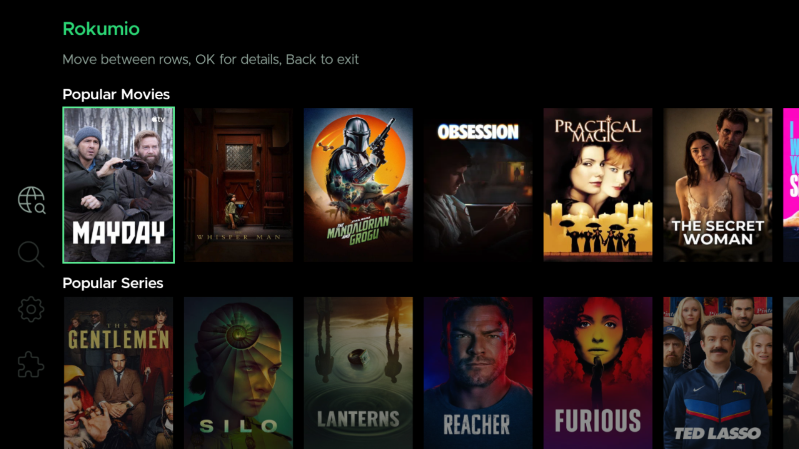
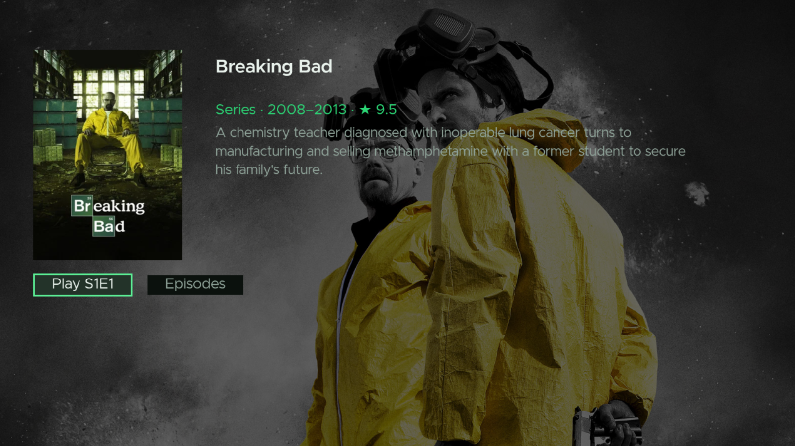
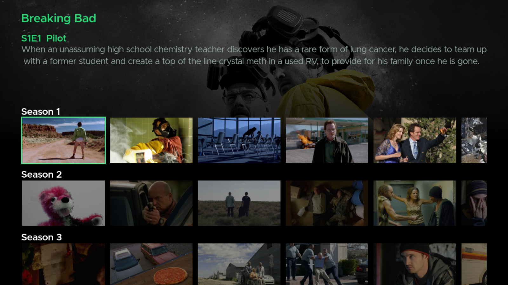

<div align="center">

# Rokumio

### A native Roku 10-foot client for Stremio addons.

<p>
  
  
  <a href="LICENSE"></a>
</p>

#### Browse catalogs, search, and play movies and series straight from your TV — remote-friendly, built for the living room.

</div>

## Images







## Features

- **Home** — Continue Watching row plus the addon catalog rows you configure
- **Search** — text search across movies and series via your addons
- **Discover** — browse by chart (Popular / New / Featured), type and genre, with
  infinite scroll through the results
- **Details & Streams** — full metadata and a picker for the streams your addons
  provide
- **Streaming server connection** — the core feature: hook up a stremio-compatible streaming backend
  (server address) and play anything your addons index straight from
  the 10-foot UI
- **Addons manager** — install/uninstall Stremio addons from their manifest URL
- **Settings** — server address, login, and library preferences

## How streaming works

Rokumio is a client — it doesn't download or transcode anything itself. You point
it at a streaming server (address + login in Settings), and it pulls playable
streams through that server and your installed addons.

Two easy ways to get a server:

- **[rokumio-service](https://github.com/gpratoe/rokumio-service)** — our companion app that stands one up for you quickly on your phone
  (you'll need a `server.js` file for it).
- **[stremio-service](https://github.com/Stremio/stremio-service)** — run it on a desktop machine and just
  point Rokumio at it. No extra setup needed.

Rokumio ships with Stremio's official metadata built-ins (Cinemeta, OpenSubtitles);
any content or stream addons come from what you install yourself.

## Run it

```bash
npm install     # install build/test tooling
npm run build   # compile + package -> dist/rokumio-client.zip
npm test        # unit tests (brs) + mock addon server integration tests
```

The build uses BrighterScript (`bsc`) and emits a sideloadable package at
`dist/rokumio-client.zip`.

## Load it on your Roku

1. Put the Roku in **[Developer Mode](https://developer.roku.com/dev/docs/developer-setup)**.
2. **[Sideload the package](https://developer.roku.com/dev/docs/developer-setup#sideloading-apps)**

## Project layout

```
components/   SceneGraph screens (Home, Search, Discover, Details, Streams, Player, …)
source/       Logic: stores (transport, addons, library, playback, …), ScreenStack, bslib
tests/        brs interpreter unit tests + harness/mocks
tools/        Mock addon server for integration tests
images/       App icons and artwork
```

## Testing

- `npm test` runs the BrightScript test suites under the `brs` interpreter
  (pure-logic stores and the screen interface contracts) and then spins up a
  mock addon server to verify the full stream flow against real HTTP requests.
- Every screen contract and the PosterTile/ChipTile item APIs are pinned by
  checks in `tests/run.js`, so an undocumented interface change fails CI loudly.

## Disclaimer

<details>
<summary>Read the project disclaimer</summary>
<br>

Rokumio is a free, open-source client application. It does not host, index, cache,
or distribute media content, run content servers or streaming services, or
maintain a catalogue of sources. It has no torrent client of its own and never
processes magnet links, `.torrent` files, or peer-to-peer swarms.

Playback that Roku can't handle directly relies on an external streaming server
you configure — a server we do not provide, operate, or control.

The only add-ons shipped by default are Cinemeta and OpenSubtitles, Stremio's
official metadata and subtitle services. Cinemeta supplies titles, artwork, and
descriptions; OpenSubtitles supplies captions. Every other add-on is installed by
you from a manifest URL you supply. We don't recommend, rank, bundle, link to, or
distribute third-party add-ons, and we don't operate or control anything you
install.

You are responsible for making sure the sources you connect and the content you
access are lawful in your jurisdiction. Don't use this software to infringe
copyright or to circumvent access controls.

Rokumio is an independent project and is not affiliated with, endorsed by, or
associated with Roku, Inc. or Stremio. All trademarks are the property of their
respective owners.

Provided "as is", without warranty of any kind. See [LICENSE](LICENSE).

</details>
